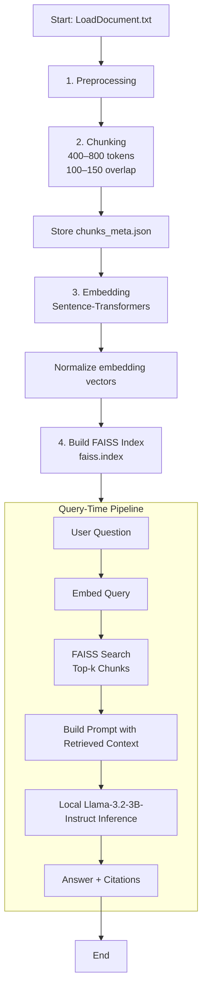

## Mini RAG-Powered Assistant

A fully local, Question-Answering system built from your documents.

---

# Overview

This project implements a local Retrieval-Augmented Generation (RAG) pipeline that allows you to query any document.

It uses:

- Llama-3.2-3B-Instruct
- FAISS for vector search
- Sentence-Transformers for embeddings
- Your doc(s).txt file as the knowledge base

All processing — embedding, retrieval, and inference — happens fully offline on the machine.

---

# Features

- Automatic chunking (semantic splitting with overlap)
- Local embeddings using sentence-transformers
- FAISS vector search
- Structured prompts with retrieved excerpts
- Local generation with Llama-3.2-3B-Instruct
- Answers with citations pointing to specific chunks

---

# Architecture

The system is divided into two phases:

---

## 1) Build Phase (One-Time)

This phase prepares your knowledge base.

1. Load documents --> convert into one sample.txt file using pypdf library use PdfReader 
2. Preprocess + Chunk into ~400–800 token segments  
3. Generate embeddings for each chunk  
4. Store embeddings in a FAISS index  
5. Save metadata (`chunks_meta.json`) linking chunks → source text  

---

## 2) Query Phase (Every user question)

This happens each time the user asks something.

1. Convert query → embedding  
2. Retrieve top-k chunks from FAISS  
3. Build a prompt containing:
    - System rules  
    - Retrieved chunks  
    - User’s question  
4. Send the prompt to Llama-3.2-3B-Instruct  
5. Receive grounded answer + citations  
6. Display final response  

---

# Directory Structure

```
├── data/
│   ├── doc1.pdf
│   ├── doc2.pdf
│   └── doc3.pdf
│   └── sample.txt  
│
├── models/
│   └── llama-3.2-3b-instruct.gguf
│
├── artifacts/
│   ├── faiss.index
│   └── chunks_meta.json
│
├── src/
│   ├── chunk_text.py
│   ├── build_index.py
│   ├── retriever.py
│   ├── generator.py
│   └── rag_pipeline.py
│
├── requirements.txt
└── README.md
```

---

## RAG Flowchart



---

# Hallucination Prevention

## Strict system prompt:

```
You must answer ONLY using the provided excerpts. 
If the answer is not in the context, reply:
"Not covered in the document."
```

We will use **top-k retrieval** and **low temperature**, which makes responses grounded and prevents hallucination.
